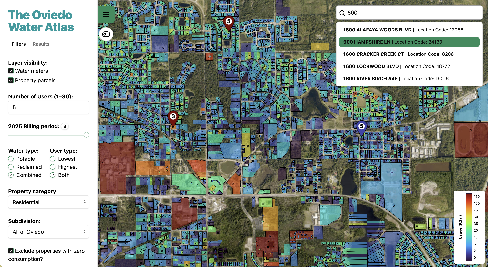
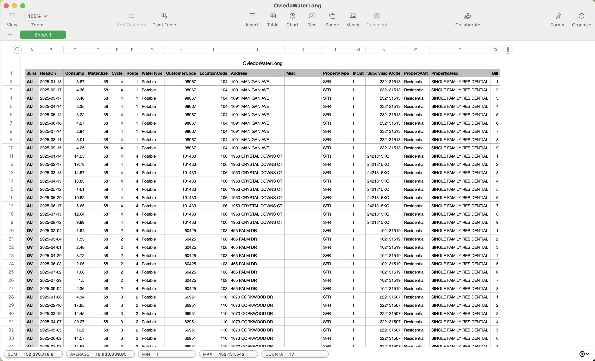
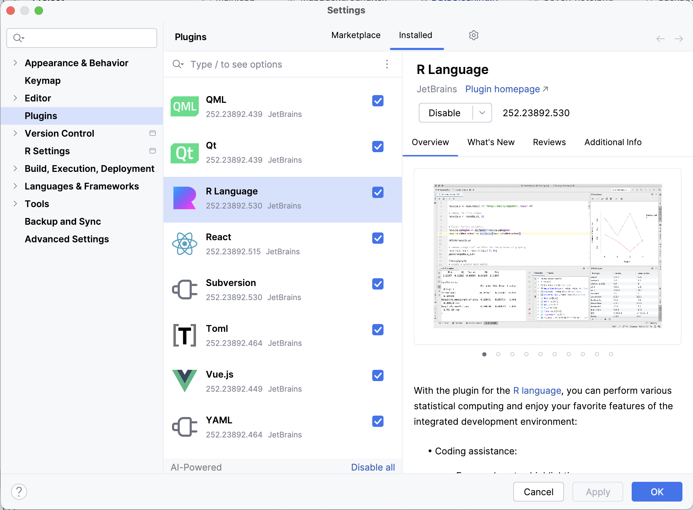

# THE OVIEDO WATER ATLAS

This GitHub repository contains the raw data (obtained via public record requests), cleaned data, data cleaning scripts, frontend code, and backend code for the Oviedo Water Atlas, an interactive data visualization platform allowing City of Oviedo residents to visualize and compare their water usage. The aim is to empower residents with transparent, accessible insights into their own water consumption, turning raw public utility records into an accessible platform for conservation awareness, community accountability, and data-driven advocacy around one of Florida's most critical resources: water.



## Project structure
* **Backend** -- contains all backend code, including the Deap and MinMax Heap code as well as the Crow server and HeapWrapper class; HeapWrapper, MinMax, and Deap are all template classes, so there are only .h files for them
* **Frontend/react** -- contains all frontend code
  * ./assets holds certain images and icons that were used in the project
  * ./public holds the larger files that are used client-side, such as the .pmtiles (proto-map tiles) used for mapping
  * ./src holds all the React code
      * ./components holds various React components used in the UI
* **DataCleaning** -- contains all code for transforming various raw data files into usable forms
    * ./RawData -- olds the raw data files obtained via public records requests
    * ./CleanedData -- contains transformed data after cleaning and processing
    * DataCleaning.R -- the script used for data processing (i.e. removing duplicates and invalid values, merging different datasets, etc.)
 
## Data set
For all intents and purposes, the **273,912-row OviedoWaterLong.csv** ("long" refers to long-formatted, as opposed to wide-formatted, data) can be considered our data set for this project. It is found under DataCleaning/CleanedData/OviedoWaterLong.csv. It contains approximately 9 months worth of water-meter-level water consumption data for the City of Oviedo, FL, broken down by factors such as Potable (drinking-quality) and Reclaimed water. OviedoWaterLong.csv is essentially an extracted layer from WaterConsumption.gdb, which is the geodatabase file originally provided by the city. Reading a .gdb file typically requires specialized GIS software (such as ArcGIS Pro), however, so it has been transformed into a format that can be opened in Excel or another spreadsheet software to be inspected for grading purposes.



## How to run this project

### Prerequisites
- [CMake](https://cmake.org/download/) >= 3.20
- [Node.js](https://nodejs.org/) >= 20.19
- [R](https://cran.r-project.org/) >= 4.x
- CLion with the [R Language plugin](https://plugins.jetbrains.com/plugin/6632-r-language-for-intellij) installed

### Backend (C++ / Crow)
1. Open the project root in CLion -- it should auto-detect `CMakeLists.txt`
2. Select the `Backend` run configuration and click "Run >"

The Crow server will start on `http://localhost:18080`. If you open that url in your browser, it should read "You have successfully reached the Crow server :D"

### Frontend (React + Vite)
Next open the console and navigate to the `react` folder within the `Frontend`.

```bash
cd DSAProject2/Frontend/react
npm install
npm run dev
```
The frontend should start up on `http://localhost:5173` in your browser. Make sure the backend server is running first or else the filtering functionalities won't work.

### Data Cleaning (R)
After installing R from CRAN and the R Language plugin for CLion, you can open any script in `DataCleaning/` in CLion and click **Run**, or source it from the R console. Before running the R code for the first time, you will need to install the following packages in the console.



**NOTE:** Running the DataCleaning.R script is **NOT** required for the project to run or work. It only needs to be done should you desire to replicate the data processing pipeline.

```r
# you will need to install these from the R console:
install.packages(c("tidyverse", "sf", "readxl", "magrittr", "jsonlite"))

# how to run the data cleaning script from the R console (when in the DataCleaning folder):
source("DataCleaning.R")
```
